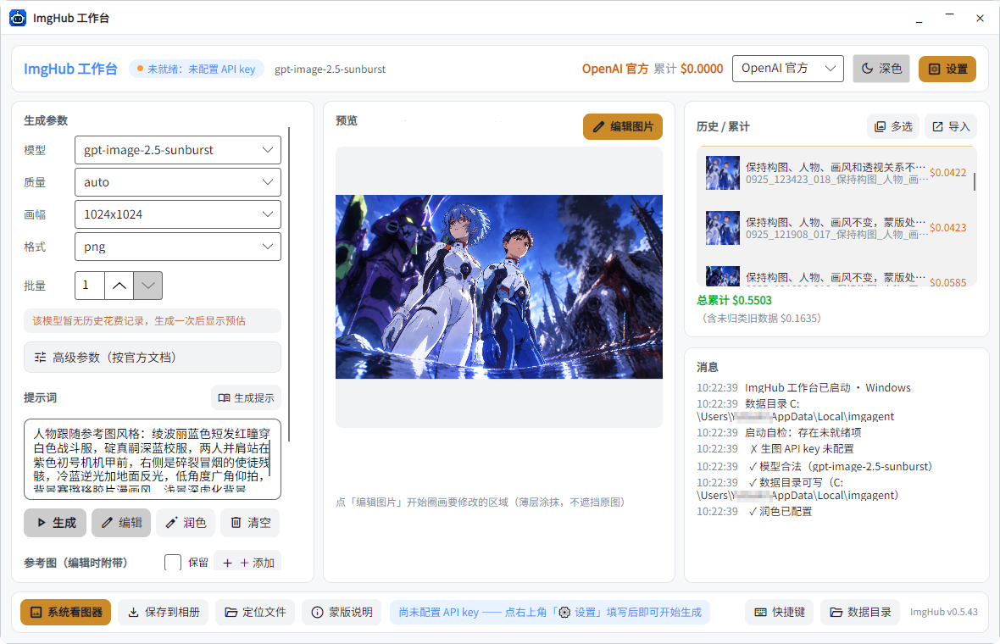
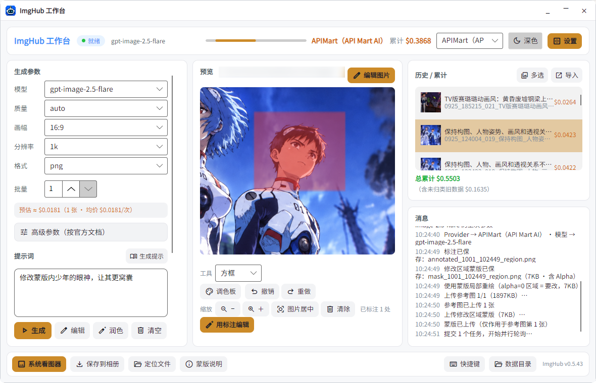
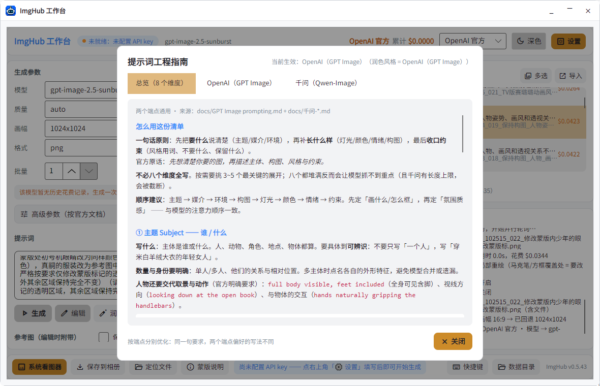
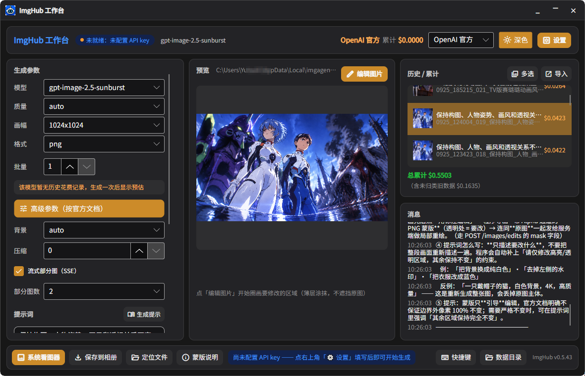

<h1 align="center">
  
</h1>

<p align="center">
  <a href="README.md">English</a> · <a href="README.zh.md">简体中文</a> · <b>日本語</b> · <a href="README.ko.md">한국어</a>
</p>

<div align="center">


[](https://github.com/Iksutuy/ImgHub/actions/workflows/ci.yml)

</div>

<p align="center">
  <b>純粋な Vibe Coding の産物です。デスクトップ版は利用可能、Android 版は未完成です。</b>
</p>

# 🖼️ ImgHub

ImgHub は「リクエストボディを手で組み立てるのは御免だ」という人のための画像生成ワークベンチです。5 つの provider のいずれかの API キーを入れれば、生成・編集・マスク・反復をひとつのウィンドウで完結できます。その間ずっとコスト表が動いているので、このセッションでいくら使ったかが常に分かります。

狙っているのは最も日常的なループです。プロンプトを書く、結果を見る、おかしい所だけ直す、気に入った一枚を残す。このループに必要なものはアプリの中に揃っているので、ファイル名を直したり、支出を数えたり、リクエストボディを手で組み立てたりするために外へ出る必要はありません。

# 🌠 スクリーンショット



**メインウィンドウ** —— 左が生成パラメーター、中央がプレビューとマークアップのツールバー、右が履歴と provider 別の累計コスト。ステータスバーはセルフチェックの結果を示し、メッセージパネルは各ステップをその都度書き出します。



**マスクによる部分再描画** —— 矩形（またはマーカー／ブラシ）で領域を囲み、アルファ付きマスクとして送信します。ログには一連の流れが残ります：注釈を保存 → アルファ付きマスクを書き出し → 参照画像をアップロード → マスクをアップロード → タスクを投入。



**プロンプト設計ガイド** —— プロンプトの書き方の内蔵リファレンス。共通の総覧に加えて provider ごとの節（OpenAI GPT Image / Qwen Image）があり、両者で好まれる書き方が異なるためです。



**詳細パラメーター** —— 公式ドキュメントに合わせたパラメーター群：背景、圧縮率、部分画像ストリーミング（SSE）など。各項目は選択中のモデルが実際に受け付ける範囲へ自動的に絞られます。

# 🌟 主な機能

1. **生成**

   - テキストからの画像生成。扱えるモデルの幅が広い（OpenAI、Google、Seedream、Flux、Grok など）
   - バッチ生成、1 回 1〜10 枚。上限はモデルと provider ごとに狭まり、Jimeng は枚数を自身で決めます
   - オフラインモード：決定的なプレースホルダー描画で、一切課金せずパイプライン全体を動かせる

2. **参照画像と編集**

   - 1 リクエストにつき最大 16 枚の参照画像（Qwen DashScope は 3 枚まで）
   - 編集対象の画像は常に 1 番目に固定 — モデルは参照画像を「位置」で解釈するため
   - マスクによる部分再描画：ブラシ、マーカー、矩形、楕円で領域を囲むと、`alpha=0` が変更対象を表すアルファマスクを書き出します

3. **Provider**

   - OpenRouter — 同期、SSE による部分画像ストリーミング対応
   - APIMart — 非同期ポーリング
   - OpenAI 公式
   - Qwen DashScope — 同期と非同期の両ルート
   - Jimeng（Volcengine） — AK/SK 署名
   - 企業向けゲートウェイや DashScope 専用ドメイン用にカスタムエンドポイントを指定可能

4. **ワークフロー**

   - プロンプト推敲：LLM が 4 案をポップアップに提示、1 つ選ぶ
   - 履歴と provider 別・合計のコスト管理、実行前の見積もり付き
   - 領域マークアップキャンバス：ズーム、パン、元に戻す／やり直し、画像ごとの注釈履歴
   - 中断復帰：task_id が永続化されるため、予期しない終了の前に投入した生成も取り戻せます

5. **インターフェース**

   - 中国語・英語・日本語、設定から切り替え、即時反映
   - ライト／ダークテーマ
   - 共有 UI ひとつで、ワイドでは 3 カラム、ナローでは積み重ねとして描画

# 🚀 はじめに

## 前提

Windows 10/11（x64）。.NET 10 SDK が必要なのはソースからビルドする場合だけです。

## ダウンロード

最新ビルドは [Releases](https://github.com/Iksutuy/ImgHub/releases) から：

| プラットフォーム | ファイル | 備考 |
|---|---|---|
| Windows 10/11 x64 | `imghub-<version>-win-x64.zip` | Native AOT、.NET ランタイム不要。解凍してそのまま実行 |
| Android 7.0+（API 23+） | `imghub-<version>-android.apk` | arm64-v8a + x86_64。まだ未完成 |

Windows のパッケージはフォルダごと解凍してください。`ImgHub.Desktop.exe` は同じフォルダの `libSkiaSharp.dll`、`libHarfBuzzSharp.dll`、`av_libglesv2.dll` を読み込みます。exe だけを取り出すと即座に終了コード `0xC0000409` で落ち、メッセージも出ません。

各リリースには `SHA256SUMS.txt` も含まれます。

## 設定

右下の **⚙ 設定** を開き、provider を選んで API キーを貼り付け、保存します。

環境変数でも設定できます：

```powershell
$env:OPENROUTER_API_KEY = "sk-or-v1-..."
$env:IMGHUB_APIMART_API_KEY = "sk-..."
```

## 課金せずに試す

オフラインモードは決定的なプレースホルダー画像を描画し、ストレージ・履歴・元に戻す・永続化まで含めたパイプライン全体を、API に一切触れずに動かします。デバッグフラグの裏に隠れています。起動前に `IMGHUB_DEBUG=1` を設定すると、設定オーバーレイに **オフライン** チェックボックスが現れます。それをオンにして、プロンプトを入力し、**生成** を押します。

データは既定で `%LOCALAPPDATA%\imghub` に置かれ、`IMGHUB_HOME` で変更できます。API キーもこのフォルダに保存され、アプリケーションログではマスクされます。改名前のフォルダ（`%LOCALAPPDATA%\imgagent`）が既にある場合、ImgHub はそれをそのまま使い続けるので、既存の画像とキーはそのまま残ります。

# 🧩 対応 Provider

| Provider | 方式 | 備考 |
|---|---|---|
| OpenRouter | 同期 | SSE による部分画像ストリーミング |
| APIMart | 非同期 | `mask_url` による本物のマスク対応 |
| OpenAI 公式 | 同期 | 2 つのエンドポイント。モデルごとにパラメーターが異なる |
| Qwen DashScope | 同期 + 非同期 | どちらのルートかはモデル次第 |
| Jimeng（Volcengine） | 非同期 | AK/SK 署名 |

リクエストは各社ドキュメントにパラメーター単位で合わせています — `background`、`output_compression`、`moderation`、ピクセル指定の `size`、`seed`、そして provider ルーティング（`only` / `order` / `ignore` / `sort` / `allow_fallbacks`）。各社の契約は [docs/](docs/) にあります。

マスクを受け取れない provider は「元画像＋注釈の合成」ルートに退避し、マスクを送ったふりはせず UI 上でその旨を明示します。

# 🌈 表示言語

UI は**中国語・英語・日本語**を同梱。設定オーバーレイの下部で言語を切り替えると即時反映され、再起動は不要です。設定は `config.json` に保存されます。

# 🏗️ アーキテクチャ

```
ImgHub.Core       プラットフォーム非依存のビジネス層（UI 依存なし）
    ↑
ImgHub.App        共有 UI（XAML + MVVM）、両 head で再利用
    ↑
ImgHub.Desktop / ImgHub.Android       薄いプラットフォーム head
```

`ImgHub.Core` は Avalonia も Android も参照しません。UI が必要とするものはすべて素のデータとサービスとして表現されており、それによって単一の XAML ツリーが Windows と Android の両方を駆動でき、テストに UI の配線が要らなくなっています。

# 🛠️ ソースからビルド

```powershell
git clone https://github.com/Iksutuy/ImgHub.git
cd ImgHub

# テスト：449 件、すべてオフライン — ネットワーク不要、API 費用ゼロ
dotnet test tests\ImgHub.Core.Tests           # 236
dotnet test tests\ImgHub.Integration.Tests    # 213

# デスクトップ版を実行
dotnet run --project src\ImgHub.Desktop

# リリースパッケージを作成（AOT デスクトップ zip + APK + SHA256SUMS.txt）
powershell -File tools\make-release.ps1
```

Android head のビルドには `dotnet workload install android` に加えて Android SDK と JDK が必要です。パッケージングの詳細は [docs/DELIVERY.md](docs/DELIVERY.md) にあります。

# 📁 プロジェクト構成

```
ImgHub/
├── src/
│   ├── ImgHub.Core/                プラットフォーム非依存のビジネス層
│   ├── ImgHub.App/                 共有 UI（XAML + MVVM）
│   ├── ImgHub.Desktop/             Windows / Linux / macOS head
│   └── ImgHub.Android/             Android head
├── tests/
│   ├── ImgHub.Core.Tests/          単体テスト 236 件
│   └── ImgHub.Integration.Tests/   端到端テスト 213 件
├── legacy/                         前世代の Python + curses 実装
├── docs/                           ドキュメント
├── tools/                          リリースパッケージング、アイコンとフォントの生成
├── build.ps1                       ワンショットビルド（デスクトップ + APK）
└── ImgHub.slnx                     ソリューションファイル
```

`legacy/` はより前の Python 製ターミナルクライアントで、C# への書き換えにおける参照実装および挙動の契約として残しています。959 件の Python テストが、期待される API ペイロード、コスト計算、エラー処理を今も固定しています。

# 📖 ドキュメント

| ドキュメント | 内容 |
|---|---|
| [docs/HANDOVER.md](docs/HANDOVER.md) | まずここから — 動かし方、どこを直すか、デバッグ方法 |
| [docs/ARCHITECTURE.md](docs/ARCHITECTURE.md) | レイヤー構造、データフロー、provider の違い、拡張ポイント |
| [docs/CONSTRAINTS.md](docs/CONSTRAINTS.md) | ハード制約と、その背景にある落とし穴 |
| [docs/DELIVERY.md](docs/DELIVERY.md) | パッケージングとリリース |
| [docs/FEATURES.md](docs/FEATURES.md) | 全機能一覧と既知のギャップ |
| [docs/i18n.md](docs/i18n.md) | 多言語対応の実装方法 |
| [docs/port-status.md](docs/port-status.md) | 移行の進捗と各ラウンドの修正記録 |
| [CHANGELOG.md](CHANGELOG.md) | バージョン履歴 |
| [CONTRIBUTING.md](CONTRIBUTING.md) | コントリビューションガイド |
| [SECURITY.md](SECURITY.md) | セキュリティモデルと非公開の報告窓口 |
| [NOTICE.md](NOTICE.md) | サードパーティライセンス（同梱フォントを含む） |

# 📝 ロードマップ

既知のギャップを、おおよそ優先度順に：

- **Android の仕上げ** — APK はビルドでき動作しますが、中国語の描画は実機で未検証で、「ギャラリーに保存」は MediaStore へ書き込むのではなくシステムのファイルピッカー経由です。
- **対応プラットフォーム** — 検証済みは Windows のみ。Avalonia 自体はクロスプラットフォームなので Linux と macOS も動くはずですが、未検証です。
- **環境診断** — Python 版の `doctor.py` パネルは未移植です。
- **キーボードショートカット** — メッセージパネルのショートカット表示はテキストのみで、キー割り当てはありません。
- **ファイルサイズ** — `ImageApi.cs` と `MainViewModel.cs` が大きくなっています。分割は独立したリファクタリングとして予定しています。

# 🤝 コントリビュート

issue も PR も歓迎します。[CONTRIBUTING.md](CONTRIBUTING.md) では最も重要な 3 つの制約を扱っています。レイヤー分離のルール、2 つのレイアウトがある中で UI のどこを直すか、そしてコンパイル済みバインディングです。

先に知っておくと良いことが 2 つあります：

- テストはすべて決定的なプレースホルダー画像を使いオフラインで走るので、実行してもお金はかかりません。
- XAML の変更はテストでカバーされません。ビューに触れたら、デスクトップ版を起動して一通りクリックしてください。

# 📜 ライセンス

GPL-3.0 — [LICENSE](LICENSE) を参照。

同梱のサードパーティコンポーネントとフォントは [NOTICE.md](NOTICE.md) に列挙しています。プロジェクトに API 認証情報は同梱されません。キーはすべてユーザーが用意し、ローカルに保存されます。
